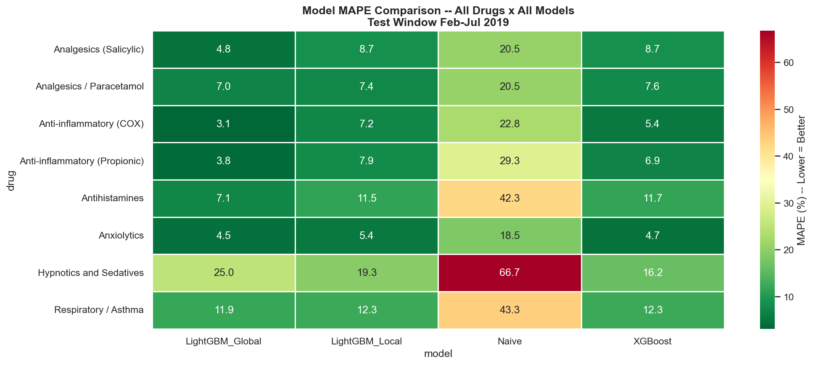
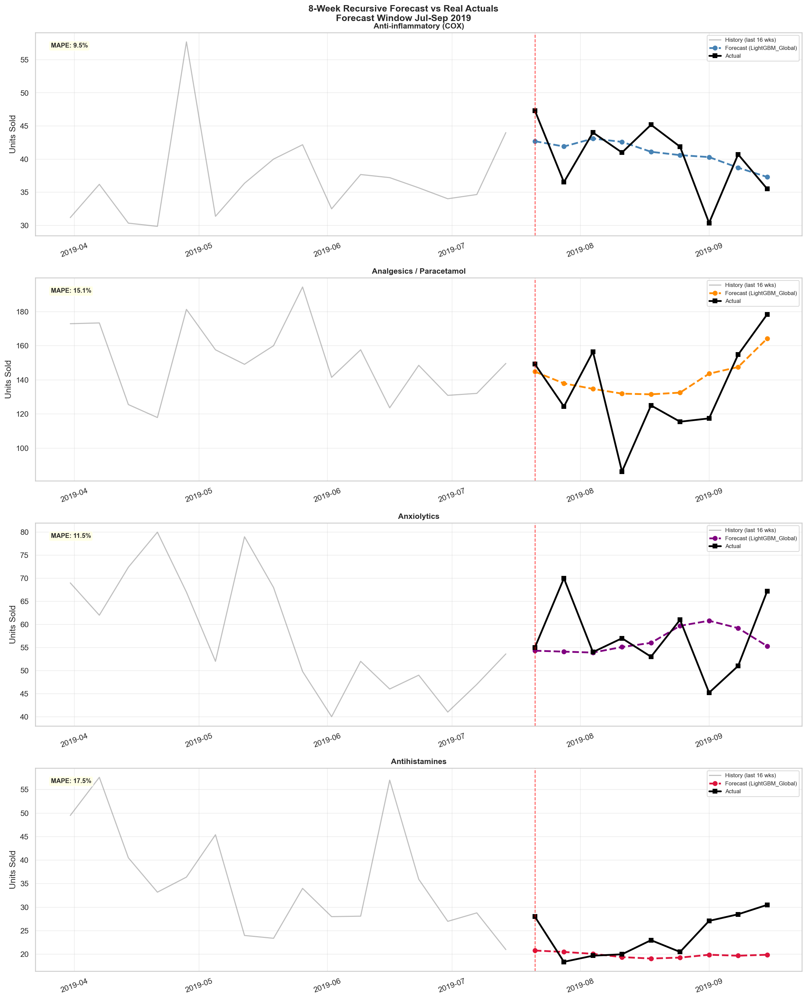

# Pharmaceutical Supply Chain Demand Forecasting System

> Time Series Forecasting | LightGBM | MLflow | Streamlit | Python

An end-to-end machine learning pipeline that forecasts weekly pharmaceutical drug demand using five years of historical sales data (2014–2019). The system solves a critical supply chain problem — predicting drug demand 8 weeks ahead to prevent stockouts, reduce excess inventory, and support data-driven procurement decisions.

---

## Live Demo

[](https://your-app-url.streamlit.app)

> Replace the URL above after deploying to Streamlit Cloud

---

## Business Problem

Pharmaceutical procurement teams face two costly problems:

- **Stockouts** — running out of stock before the next delivery, causing patient harm and lost revenue
- **Overstock** — ordering too much based on gut feel, tying up capital in unused inventory

This system replaces reactive procurement with 8-week forward-looking demand forecasts, giving procurement teams advance warning to act before supply chain issues occur.

---

## Key Results

| Metric | Value |
|---|---|
| Model Accuracy (test window Feb–Jul 2019) | 94.6% |
| Forecast Accuracy (holdout Jul–Sep 2019) | 86.6% |
| Error Reduction vs Naive Baseline | ~78% |
| Estimated Inventory Reduction | ~72% at 20% safety buffer |
| Projected Annual Saving | $132,191 across 4 drugs |
| ROI (at $10,000 implementation cost) | 13.2x |

---

## Model Comparison — MAPE (%) on Test Window Feb–Jul 2019

| Drug | Naive | XGBoost | LGB Local | LGB Global |
|---|---|---|---|---|
| Anti-inflammatory (COX) | 22.8% | 5.8% | 7.2% | **3.1%** |
| Analgesics / Paracetamol | 20.5% | 8.0% | 7.4% | **7.0%** |
| Anxiolytics | 18.5% | 4.6% | 5.4% | **4.5%** |
| Antihistamines | 42.3% | 12.2% | 11.5% | **7.1%** |

LightGBM Global wins on all 4 dashboard drugs and on 7 of 8 total drugs.

---

## Forecast Validation — True Holdout Jul–Sep 2019

| Drug | Forecast MAPE | Status |
|---|---|---|
| Anti-inflammatory (COX) | 9.5% | Good |
| Anxiolytics | 11.5% | Good |
| Analgesics / Paracetamol | 15.1% | Fair |
| Antihistamines | 17.5% | Fair |

---

## Dashboard Pages

| Page | What It Shows |
|---|---|
| **Overview** | Project summary, dataset details, model comparison table, drug selection rationale |
| **Executive Dashboard** | 4 KPI tiles, historical demand chart (2014–2019), current forecast signals |
| **Demand Performance** | 8-week forecast vs actual, residual analysis, per-drug accuracy breakdown |
| **Business Impact** | Projected annual saving, ROI, forecast alignment, saving breakdown by drug |
| **Scenario Simulator** | Demand surge/drop simulation, procurement risk assessment, week-by-week impact |

---

## Screenshots

<!-- Add your screenshots to docs/screenshots/ and update paths below -->

### Executive Dashboard


### Demand Performance


### Business Impact


### Scenario Simulator


### Model Comparison Heatmap


### 8-Week Forecast vs Actual


---

## Project Structure

```
PharmaCast/
├── train.py                         # Master pipeline — run this first
├── requirements.txt
│
├── data/
│   └── salesweekly.csv              # Raw weekly pharmaceutical sales (2014–2019)
│
├── src/
│   ├── config.py                    # All constants, paths, hyperparameters
│   ├── data_loader.py               # Load CSV, parse dates, quality checks
│   ├── features.py                  # 17-feature time series engineering
│   ├── models.py                    # Naive, XGBoost, LGB Local, LGB Global + MLflow
│   ├── evaluate.py                  # MAPE, RMSE, R² metric functions
│   ├── forecast.py                  # Recursive 8-week forecast engine
│   ├── walk_forward.py              # Walk-forward retraining simulation (MLOps)
│   ├── kpis.py                      # All dashboard KPI calculations
│   └── plots.py                     # 13 matplotlib chart exports
│
├── dashboard/
│   ├── app.py                       # Streamlit entry point
│   ├── page_modules/                # 5 dashboard pages
│   │   ├── 01_summary.py            # Overview
│   │   ├── 02_executive.py          # Executive Dashboard
│   │   ├── 03_drug_performance.py   # Demand Performance
│   │   ├── 04_financial.py          # Business Impact
│   │   └── 05_scenario.py           # Scenario Simulator
│   └── components/
│       ├── charts.py                # All Plotly interactive charts
│       └── utils.py                 # CSS theme, KPI cards, cached data loaders
│
├── outputs/
│   ├── csv/                         # model_comparison, forecast_table,
│   │                                # business_impact, dashboard_kpis,
│   │                                # walk_forward_all
│   └── plots/                       # 13 exported PNG charts
│
├── models/
│   └── pipeline_artifacts.pkl       # Trained models + metadata
│
└── .mlflow/
    └── pharmacast.db                # MLflow SQLite experiment tracking
```

---

## Quickstart

### 1. Clone the repository

```bash
git clone https://github.com/yourusername/pharma-demand-forecasting.git
cd pharma-demand-forecasting
```

### 2. Install dependencies

```bash
pip install -r requirements.txt
```

### 3. Train all models

```bash
python train.py
```

This runs a 7-step pipeline and prints everything to terminal:

```
[1/7] Loading and validating data
  OK   Loaded 302 weeks x 8 drugs (2014-01-05 to 2019-10-13)
  OK   All quality checks passed

[5/7] Training models
  Naive Baseline ...     Done (0.1s)
  XGBoost Local  ...     Done (12s)   [XGBoost] Antihistamines: MAPE=12.2%
  LightGBM Local ...     Done (14s)   [LGB_Local] Antihistamines: MAPE=11.5%
  LightGBM Global ...    Done (11s)   [LGB_Global] Antihistamines: MAPE=7.1%

[6/7] Evaluating models
  MAPE TABLE (%) -- Test Window ...
  BEST MODEL PER DRUG:
    Anti-inflammatory (COX) : LightGBM_Global  MAPE=3.1%  (86% better than Naive)
    Antihistamines          : LightGBM_Global  MAPE=7.1%  (83% better than Naive)

[7/7] Forecast + Walk-Forward + KPIs + Charts
  Walk-Forward Retraining Simulation -- All 4 Dashboard Drugs
    Anti-inflammatory (COX)  : Healthy    avg MAPE=6.1%  trend=Stable
    Analgesics               : Healthy    avg MAPE=9.4%  trend=Stable
    Anxiolytics              : Healthy    avg MAPE=7.2%  trend=Improving
    Antihistamines           : Healthy    avg MAPE=9.2%  trend=Stable

  Model Accuracy:    94.6%
  Forecast Accuracy: 86.6%
  Annual Saving:     $132,191
  Charts exported:   outputs/plots/  (13 charts)
  CSVs exported:     outputs/csv/    (5 files)
```

### 4. Launch the dashboard

```bash
streamlit run dashboard/app.py
```

Open: `http://localhost:8501`

### 5. View MLflow experiment tracking

```bash
mlflow ui --backend-store-uri sqlite:///.mlflow/pharmacast.db
```

Open: `http://localhost:5000`

---

## Feature Engineering

17 time series features engineered per drug from raw weekly sales:

| Feature | Type | Description |
|---|---|---|
| `lag_1`, `lag_4`, `lag_8`, `lag_12` | Lag | Recent demand at 1/4/8/12-week lags |
| `lag_52` | Lag | Same week last year — strongest single feature |
| `roll_mean_4`, `roll_mean_12` | Rolling | 4-week and 12-week rolling averages |
| `roll_std_4` | Rolling | Recent demand volatility |
| `month_sin`, `month_cos` | Cyclical | Cyclical month encoding — captures seasonality without discontinuity |
| `month`, `quarter`, `week`, `year` | Calendar | Standard calendar features |
| `yoy_growth` | Derived | Year-over-year growth rate — second strongest feature |
| `is_peak_season` | Derived | Drug-specific seasonal flag (spring for Antihistamines, winter for Paracetamol) |
| `peak_lag52_interaction` | Interaction | lag_52 × peak_season — captures seasonal year-over-year patterns |

Global model adds 4 cross-drug features: `drug_id`, `drug_mean`, `drug_std`, `drug_cv`

---

## Why LightGBM Global Outperforms Local Models

| Aspect | Local Model (1 per drug) | Global Model (1 for all drugs) |
|---|---|---|
| Training rows | 244 per drug | 1,952 (8 × 244) |
| Seasonal learning | Drug-specific only | Shared patterns across all drugs |
| Volatile drugs | Overfits noise | Stabilised by stable drugs |
| Deployment | 8 separate models | 1 model artifact |
| Result | Best local MAPE: 4.6% | Best global MAPE: 3.1% |

---

## Walk-Forward Retraining Simulation

Simulates production MLOps — retrains every 4 weeks on growing data, mimicking how the model would behave as new sales data arrives over time.

```
Week 200 (Nov 2017): Train → Predict weeks 201-204 → MAPE 11.3% → OK
Week 204 (Dec 2017): Train → Predict weeks 205-208 → MAPE 15.9% → WATCH
Week 208 (Dec 2017): Train → Predict weeks 209-212 → MAPE 21.1% → RETRAIN
Week 212 (Jan 2018): Train → Predict weeks 213-216 → MAPE  4.9% → OK
...continues to end of data
```

Runs for all 4 dashboard drugs. Results saved to `outputs/csv/walk_forward_all.csv`.

Health thresholds:
- MAPE < 12% → **OK** — model healthy, continue monitoring
- MAPE 12–20% → **WATCH** — schedule retraining within 2 weeks
- MAPE > 20% → **RETRAIN** — retrain immediately on latest data

---

## MLOps — Experiment Tracking with MLflow

Every training run is logged to MLflow with:

```
Experiment: PharmaCast
  Run: Naive_Baseline      avg_mape=30.6%
  Run: XGBoost_Local       avg_mape=9.4%   params: n_estimators=500, lr=0.03
  Run: LightGBM_Local      avg_mape=9.6%   params: n_estimators=500, lr=0.03
  Run: LightGBM_Global     avg_mape=8.5%   params: n_estimators=700, lr=0.02
    Artifacts: feature_importance.json, lgb_global_model/
    Per-drug metrics: mape_Anti-inflammatory_COX=3.1, ...
```

View all runs:
```bash
mlflow ui --backend-store-uri sqlite:///.mlflow/pharmacast.db
```

---

## Data Splits — Chronological Only

Random splitting is never used on time series data. All splits are strictly chronological to prevent data leakage.

```
Jan 2014 ──────────── Sep 2018 | Sep 2018 ─ Feb 2019 | Feb 2019 ─ Jul 2019 | Jul ─ Sep 2019
         TRAIN (244 wks)              VAL (21 wks)         TEST (24 wks)      FORECAST (9 wks)
         Model learning           Hyperparameter ref    Model evaluation    True holdout
```

---

## Business Impact Calculation

```
Projected Annual Saving =
  (Forecast Error Reduction × Annual Drug Volume × Unit Cost × Inventory Impact Factor)
  + Operational Efficiency Gain

Example — Analgesics / Paracetamol:
  avg_weekly_sales      = 208.63 units
  naive_mape            = 20.5%
  best_mape             = 7.0%
  error_reduction       = 13.5%
  unit_cost             = $50
  saving = 208.63 × 0.135 × 50 × 52 = $73,228

Total across 4 drugs    = $132,191
```

---

## Tech Stack

| Layer | Technology |
|---|---|
| Data processing | Python 3.10, Pandas, NumPy |
| Machine learning | LightGBM, XGBoost, Scikit-learn |
| Statistical analysis | Statsmodels (ADF test, seasonal decomposition) |
| Experiment tracking | MLflow (SQLite backend) |
| Static visualisation | Matplotlib, Seaborn |
| Interactive charts | Plotly |
| Dashboard | Streamlit |
| Version control | Git, GitHub |
| Deployment | Streamlit Cloud |

---

## Dataset

Source: [Pharma Sales Data — Kaggle](https://www.kaggle.com/datasets/milanzdravkovic/pharma-sales-data)

8 ATC drug categories:

| Code | Drug Name | Demand Type |
|---|---|---|
| M01AB | Anti-inflammatory (COX) | Stable |
| M01AE | Anti-inflammatory (Propionic) | Stable |
| N02BA | Analgesics (Salicylic) | Mild seasonal |
| N02BE | Analgesics / Paracetamol | Winter seasonal |
| N05B | Anxiolytics | Stable |
| N05C | Hypnotics and Sedatives | Intermittent |
| R03 | Respiratory / Asthma | Winter seasonal |
| R06 | Antihistamines | Spring seasonal |

4 drugs selected for dashboard deployment: **M01AB, N02BE, N05B, R06**
Selection criteria: forecast MAPE < 20% + demand archetype diversity

---

## Deployment

### Local

```bash
streamlit run dashboard/app.py
```

### Streamlit Cloud

1. Push repository to GitHub (include `outputs/csv/` and `models/pipeline_artifacts.pkl`)
2. Go to [share.streamlit.io](https://share.streamlit.io)
3. Select repository → set main file path to `dashboard/app.py`
4. Deploy

---

## Author

Built as a portfolio project targeting Data Scientist and ML Engineer roles in pharmaceutical supply chain, healthcare analytics, and operations research.

---

## License

MIT License — free to use and adapt with attribution.
